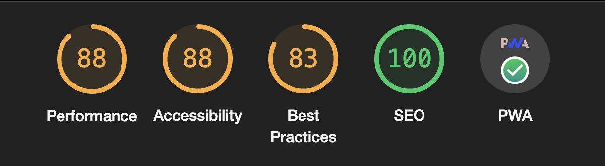

<div id="top"></div>

[![LinkedIn][linkedin-shield]][linkedin-url]

<!-- PROJECT LOGO -->
<br />
<div align="center">
  <a href="https://github.com/mocca-dev/infohub">
    
  </a>

<h3 align="center">Infohub</h3>

  <p align="center">
    This app began as a solution for a daily problem and then I ended up using it to put in practice several NextJS concepts and learn about it. A friend of mine wanted a kind of dashboard to keep in background all the day with some information at a glace, such as the USD/ARS parity, holidays and news. 
    <br />
    <a href="https://infohub.vercel.app/">View Demo</a>
  </p>
</div>

<div align="center">
  
</div>
<br>

<!-- TABLE OF CONTENTS -->
<details>
  <summary>Table of Contents</summary>
  <ol>
    <li>
      <a href="#about-the-project">About The Project</a>
      <ul>
        <li><a href="#built-with">Built With</a></li>
      </ul>
    </li>
    <li>
      <a href="#getting-started">Getting Started</a>
      <ul>
        <li><a href="#prerequisites">Installation and Startup</a></li>
      </ul>
    </li>
    <li><a href="#usage">Usage</a>
      <ul>
        <li><a href="#prerequisites">Load and play</a></li>
        <li><a href="#prerequisites">Settings</a></li>
      </ul>
    </li>
    <li><a href="#license">License</a></li>
    <li><a href="#contact">Contact</a></li>
  </ol>
</details>

<!-- ABOUT THE PROJECT -->

## About The Project

<div align="center">
  
</div>
<br>
<br>

<p align="right">(<a href="#top">back to top</a>)</p>

### Built With

- [NextJS 13 ▲](https://nextjs.org)
- [Next PWA](https://www.npmjs.com/package/next-pwa)
- [TypeScript](https://www.typescriptlang.org)
- [Google News JSON](https://www.npmjs.com/package/google-news-json)
- [React Chartkick](https://www.npmjs.com/package/react-chartkick)

<p align="right">(<a href="#top">back to top</a>)</p>

<!-- GETTING STARTED -->

## Getting Started

This app is made with NextJS so the installation process is simple.

### Installation and Startup

1. Clone the repo
   ```sh
   git clone https://github.com/mocca-dev/infohub
   ```
2. Install NPM packages
   ```sh
   npm install
   ```
3. Finally you have to simply run the app and you're ready to go with the client.
   ```sh
   npm run dev
   ```

<p align="right">(<a href="#top">back to top</a>)</p>

<!-- USAGE EXAMPLES -->

## Usage

### USD History

<div align="center">
  
</div>
<br>
<p align="right">(<a href="#top">back to top</a>)</p>

### News

<div align="center">
  
</div>
<br>
<p align="right">(<a href="#top">back to top</a>)</p>

<!-- LICENSE -->

## License

Distributed under the MIT License. See `LICENSE.txt` for more information.

<p align="right">(<a href="#top">back to top</a>)</p>

<!-- CONTACT -->

## Contact

Nicolás Tonelli - nicolastonelli1406@gmail.com

Project Link: [https://github.com/mocca-dev/infohub](https://github.com/mocca-dev/infohub)

<p align="right">(<a href="#top">back to top</a>)</p>

<!-- MARKDOWN LINKS & IMAGES -->
<!-- https://www.markdownguide.org/basic-syntax/#reference-style-links -->

[contributors-shield]: https://img.shields.io/github/contributors/github_username/repo_name.svg?style=for-the-badge
[contributors-url]: https://github.com/github_username/repo_name/graphs/contributors
[forks-shield]: https://img.shields.io/github/forks/github_username/repo_name.svg?style=for-the-badge
[forks-url]: https://github.com/github_username/repo_name/network/members
[stars-shield]: https://img.shields.io/github/stars/github_username/repo_name.svg?style=for-the-badge
[stars-url]: https://github.com/github_username/repo_name/stargazers
[issues-shield]: https://img.shields.io/github/issues/github_username/repo_name.svg?style=for-the-badge
[issues-url]: https://github.com/github_username/repo_name/issues
[license-shield]: https://img.shields.io/github/license/github_username/repo_name.svg?style=for-the-badge
[license-url]: https://github.com/github_username/repo_name/blob/master/LICENSE.txt
[linkedin-shield]: https://img.shields.io/badge/-LinkedIn-black.svg?style=for-the-badge&logo=linkedin&colorB=555
[linkedin-url]: https://linkedin.com/in//nicolás-tonelli-181624b9/
[product-screenshot]: images/screenshot.png
